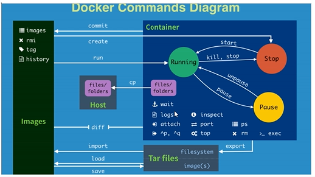

## Docker 使用笔记

机器： 阿里云（张总esc)

用处  :

> 快速打包部署，一键运行。
>
> 项目拓展服务器A,B,C
>
> docker是内核级别的虚拟化，可以把资源压榨到极致。

基本构成：

> 镜像 image ， 模板可以创建多个容器服务。
>
> 容器 container， 独立运行一个，或集群的应用。可以理解为简易linux系统
>
> 仓库 repository， 存放镜像的地方。

[安装](https://docs.docker.com/engine/install/centos/#install-docker-engine)

RUN 命令的运行流程

> 1. Docker本机寻找运行的image
> 2. 找不到就去docker Hub下载到本地
> 3. docker run 本地镜像名

帮助命令：

> docker version  版本信息
>
> docker info   系统详细信息
>
> docker 命令 --help
>
> [命令文档](https://docs.docker.com/engine/reference/commandline/images/)

<hr/>

**镜像命令**

docker images 查看本地主机的所有镜像。

```shell
docker images -a
```

docker search 名称 搜索dockerHub的镜像

```shell
docker search mysql --filter=STARS=700
```

docker pull 下载镜像

```she
docker pull 名称[:tag]   (版本查找docker Hub)
docker pull mysql:8.0
```

docker rmi 删除镜像

```she
 docker rmi -f a70d36bc331a  根据id进行删除
 docker rmi -f b97242f89c8a bf756fb1ae65 根据id删除多个镜像
 docker rmi -f $(docker images -aq)  删除全部镜像
 
```

**容器命令**

<hr/>

有了镜像才有容器。下载一个centos镜像进行操作

```she
docker pull centos
```

新建容器并启动

```
docker run [-params] image
--name="Name" 容器名称，a,b区分容器
-d            后台启动
-it           进入容器查看内容
-p            指定容器端口 （主机端口：容器端口）         
-P            随机端口

docker run -it centos /bin/bash  进入运行中的容器
exit 退出
ctrl + p + q 容器不停止推出
```

查看容器

```sh
docker ps      正在启动的所有容器
docker ps -a   所有启动容器
docker ps -n=2 最近启动的2个容器
docker ps -q   正在启动的所有容器id
```

删除容器

```shell
docker rm a70d36bc331a  无法删除正在运行的容器
docker rm -f $(docker ps -aq)  删除所有容器
```

容器生命周期命令

```shell
 docker start cccff5fa6b45
 docker restart cccff5fa6b45
 docker stop cccff5fa6b45
 docker kill  cccff5fa6b45
```

**辅助事项**

```she
docker run -d 镜像名；容器后台运行，必须要一个前台进程，否则会自动停止。
docker logs -tf --tail 20 cccff5fa6b45  查看指定容器日志
docker top cccff5fa6b45   查看指定容器中进程信息
docker inspect cccff5fa6b45 容器元数据信息
```

**进入容器执行**

```sh
docker exec -it cccff5fa6b45 /bin/bash  进入容器开启新终端
docker attach cccff5fa6b45              进入容器正在执行的终端，不启动新线程

```

**从docker容器拷贝文件到本地**

```she
docker cp cccff5fa6b45:/home/docker-cp.txt /home
                       容器文件              本地路径
将来可以采用数据卷技术自动同步。
```


[其他人不错的笔记](https://www.cnblogs.com/Mrchengs/category/1396094.html)